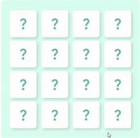
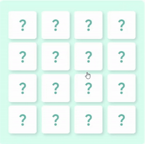
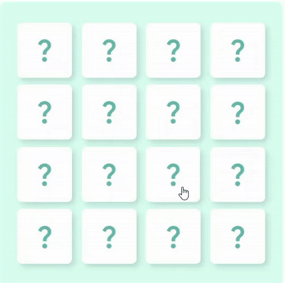

# Memory-cards

The project is a memory game that's very helpful for boosting one's memory. The player should find a pair of similar cards. All cards are hidden unless clicked. The purpose of the game to find all cards. The game is sumpremely easy to use and doesn't require any extra efforts. 

## Features

- **Animated flipping**:
  cards flip when clicked and show the image on it

* **Image matching**: when two cards are selected, the program checks their matching. If they are, cards remain opened
* **Animated mismatching**: if cards aren't matched, they shake and then flip back
* **Automatic cards mix**: cards are mixed randomly at the beginning of the game

## Technologies

- **HTML & CSS**: used to style the fame field and cards
  
- **JavaScript**: used to build game logic, handle events, flipping animation and cards matching

- **DOM Manipulation**: 
    - **querySelector** 
    - **classList.add** 
    - **classList.remove** and etc.

- **Animations and Transitions**: used to make visual effects (flipping cards, unmatched shaking) via adding and removing CSS selectors with pre-maked animation and transition

## Gifs

### Matched cards

### Unmatched cards

### Full game

